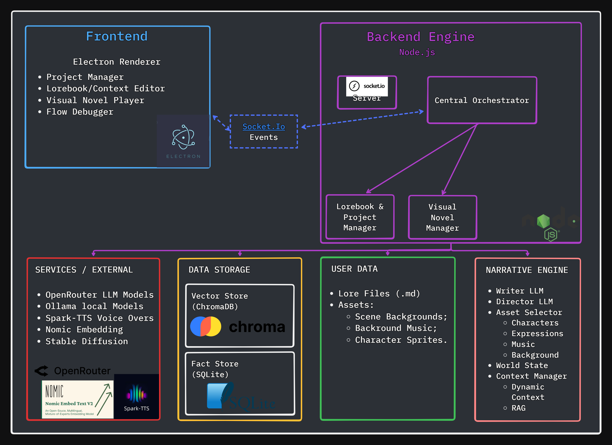
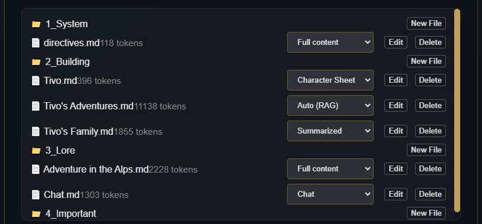
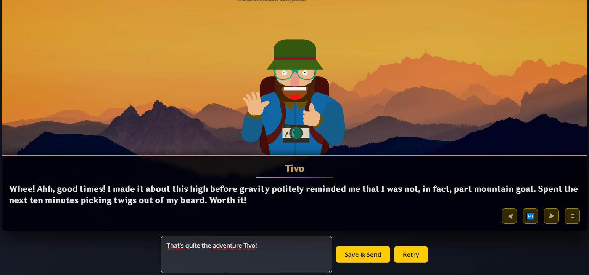
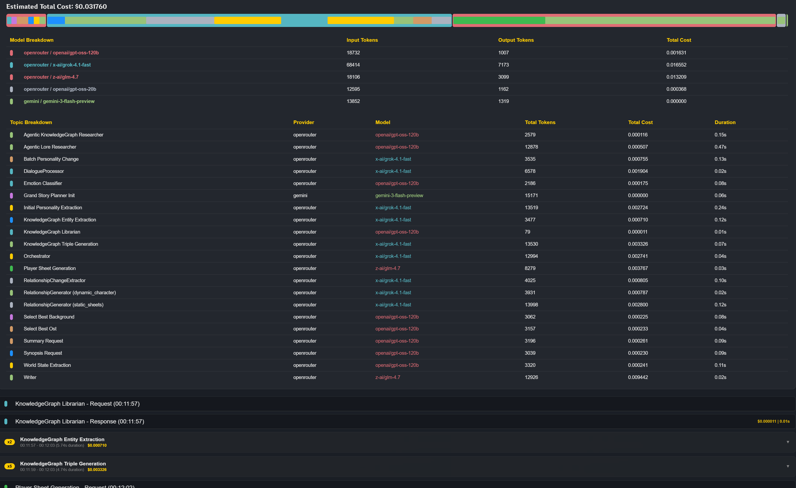

# Dynamic Narrative Engine

 

A robust self-contained application for creating dynamic long-form narratives using AI. This engine combines a multi-agent AI system powered by a persistent, dynamic world-state that ensures long-term continuity, coherence, and linear character development while offering a seamless creative cycle workflow.

This was created to get a deeper understanding of modern AI techniques and solve problems found on the most popular role playing systems.

* SillyTavern: A fantastic tool with a lot of depth and capabilities, but it's also its weakness. It feels overwhelming and is too complex for the average user who just wants a plug & play experience.
* RisuAI: Simple to use but lacks more advanced features.

However what I found on every RP (role-playing) system is that they all share the same limitation: They strive to complete the user's narrative on mostly one LLM call and have very limited multi-character support. This is correct for the user experience to feel snappy and to save costs, but nowadays high end popular models have gotten very cheap, so it's now reasonable to have a multi-agent RP experience, where we give each LLM a specific task instead of relying on large monolithic API calls that result in subpar output due to LLM's instruction overflow and attention drift. Using a multi-agent setup ensures every part of the experience goes to it's fullest potential and the narrative retains supreme quality and consistency while giving life to multiple characters simultaneously. 

## Core Vision

This project aims to address the fundamental limitations of other AI storytelling systems, including poor long-term memory, poor narrative consistency, and a non-linear creative workflow. Rather than a story being a single continuous sequence of text, this engine models it like a simulated world. This engine features a ground-up architecture with the design goals to:

*   **Understand Context:** Distil a sophisticated layered memory system. It provides the AI with deep, nested, regressive context by filtering relevant context from the story's entire history.
*   **Consistent Ongoing Narrative:** Maintain a factual "world brain" which tracks characters, locations, relationships, and inventory, and prevent logical contradictions.
*   **Multi Character Support:** Supports multiple characters at once, they can enter and leave the scenes at will, appear on the screen simultaneously, interact and each have their own personalities, relationship tracking and goals.
*   **Allow Ongoing Character Development:** Characters must change, and so too must their relationships, dynamically over recent previous events as the narrative evolves.
*   **Empower the Creator:** All-in-one environment for world-building, writing, testing, and experiencing the final story.
*   **Drag & Drop Asset Management:** No manual definition of every visual asset. Simply drop "Forest.png", "Desert.png" to the project's background folder, "Serene.mp3", "Windy.mp3" to the music folder or "Tivo_happy.png", "Tivo_sad.png" for automatic asset usage.

## Key Features

*   **Hierarchical Long-Term Memory:** A unique Fulltext -> Summary -> Synopsis Hierarchy is used to model the limits of the AI context window. Further augmented with a "Slotted RAG" (Retrieval Augmented Generation) system to inject relevant memories back into their historic chronological position in the narrative timeline to provide the AI with important temporal context.

*   **The "Director" AI:** A 'Director' agent (Orchestrator) reviews the narrative events periodically. It offers high-level feedback and guidance to direct an overarching main 'Writer' AI to mitigate plot drift and maintain thematic representation longitudinally. Keeps an internal notebook in a self-feedback loop to keep track of the narrative's goals, keeping the writer reality anchored and naturally reminding it of key missing events.

*   **Dynamic World-State:** The engine parses narrative text logs after each turn of events to extract and track key narrative facts (e.g., `RELATIONSHIPCHANGE: Tivo, Player, +5`, `INVENTORYCHANGE: Player, Pickaxe +1`). The results create a persistent "world brain," extracting the final systems process as the 'ground truth' story-state.

*   **State-Sensitive Character Evolutions:** Character personality traits and locked numerical relationships track numerically based on in-story events as structured data. This data is then distilled or synthesized back into natural language rules (e.g., `[Tivo is now more confident]`) and injected into the AI performance prompt for tracking over time.

*   **Frictionless Asset Pipeline:** Simple drag-and-drop functionality for character sprites, background images, and music. The system selects the best assets based on file names indicated by the narrative context—no need for developers to edit lengthy, complex configuration files.

*   **Integrated Creation Environment:** The application is a stand-alone project and file-folder package, a contained manager where creators can construct their world bible, edit character sheets, and write world lore in the same environment. It offers an integrated workflow from concept to execution.

*   **Built-in Diagnostics & Performance Monitoring:** A real-time diagnostic interface provides creators with a detailed description of each turn, including processing time and estimated token cost for each AI agent and process—enabling fine-tuning and optimization.

## Architectural Overview

The engine is a modular, event-driven architecture—designed for resiliency and extensibility. The backend processes are managed in Node.js and communicate with the Electron frontend via Socket.IO multi-webview.

*   **Core Application:** The UI is managed by an Electron shell. The main process is Node.js. All inter-process communications are handled as real-time events using Socket.IO.

*   **AI Agent System:** Multiple LLM agents with specialized functions work together:
    *   **Writer:** Generates the core narrative prose.
    *   **Director (Orchestrator):** Provides high-level creative direction.
    *   **Fact Extractor:** Parses text and generates structured world state data.
    *   **Synthesizer:** Converts structured data back into natural language to construct prompts.
    *   **Auxiliary Agents:** A set of smaller agents for functions like emotional classification, asset selection, or dialogue formatting.

*   **Dual-Memory System:** The engine maintains context using two separate but related memories:
    *   **Semantic Memory (ChromaDB):** A vector memory that stores text embeddings for "auto" lore files and the full history of chapter files. It answers, *"What parts of the story are relevant right now?"*
    *   **Factual Memory (SQLite):** A relational memory that stores structured world state data. It answers, *"What is verifiably true in the world right now?"*

## Technology Stack

| Category | Technologies |
| :--- | :--- |
| **Core Backend** | Node.js, Electron.js, Socket.IO |
| **Databases** | ChromaDB (Vector Store), SQLite (Fact Store) |
| **AI/LLM** | OpenRouter API, Ollama (Embeddings) |
| **Frontend** | HTML, CSS, JavaScript (Vanilla) |
| **Libraries** | LangChain.js, Axios, Marked.js |
| **TTS (External)** | Spark-TTS or Alltalk TTS |
| **Diffusion (External)** | Webui1111 or ComfyUi |

## Visual Showcase

| In-App Editor & File Management |
| :---: |
|  |

| Visual Story Player |
| :---: |
|  |

| Performance & Cost Dashboard |
| :---: |
|  |

---

## Regarding Source Code

This is an ambitious, ongoing hobby project, hence the source code is not available right now. This repository serves as a detailed architectural showcase of the design and potential.
