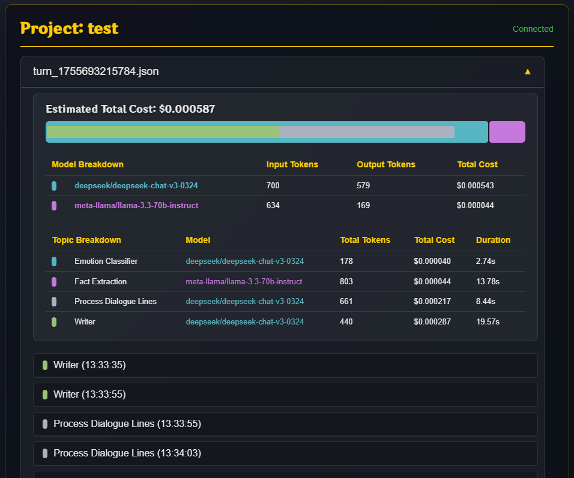

# Dynamic Narrative Engine

 

A robust self-contained application for creating dynamic long-form narratives using AI. This engine combines a multi-agent AI system powered by a persistent, dynamic world-state that ensures long-term continuity, coherence, and linear character development while offering a seamless creative cycle workflow.

This was created to get a deeper understanding of modern AI techniques and solve problems found on the most popular role playing systems.

* **SillyTavern**: A fantastic tool with a lot of depth and capabilities, but it's also its weakness. It feels overwhelming and is too complex for the average user who just wants a plug & play experience.
* **RisuAI**: Simple to use but lacks more advanced features.

However, what I found on every RP (role-playing) system is that they all share the same limitations: very limited multi-character support, poor long-context/memory management, and a requirement for the user to do exhaustive "lore books." They strive to complete the user's narrative in a single LLM call. While this feels snappy, modern high-end models are cheap enough to allow for a multi-agent experience. We give each LLM a specific task instead of relying on large monolithic API calls that result in subpar output due to instruction overflow and attention drift. Using a multi-agent setup ensures every part of the experience goes to its fullest potential and the narrative retains supreme quality and consistency while giving life to multiple characters simultaneously.

## Core Vision

This project aims to address the fundamental limitations of other AI storytelling systems. Rather than a story being a single continuous sequence of text (chat), this engine models it like a simulated world. The user can easily engage in a brand new story, or base it on their favorite fiction and be able to experience and interact with a "What if?" sequel.

The design goals are to:

*   **Understand Context:** Distill a sophisticated layered memory system. It provides the AI with deep, nested, regressive context by filtering relevant context from the story's entire history using a "Slotted RAG" approach to preserve temporal order.
*   **Consistent Ongoing Narrative:** Maintain a factual "world brain" which tracks characters, locations, relationships, and inventory, and prevents logical contradictions.
*   **Multi Character Support:** Support multiple characters at once; they can enter and leave scenes at will, appear on the screen simultaneously, interact, and each have their own personalities, relationship tracking, and goals.
*   **Allow Ongoing Character Development:** Characters must change, and so too must their relationships, dynamically over recent events as the narrative evolves.
*   **Empower the Creator:** All-in-one environment for world-building, writing, testing, and experiencing the final story, complete with CLI tools for automated test flows.
*   **Drag & Drop Asset Management:** No manual definition of every visual asset. Simply drop assets into the project's folders for automatic, context-aware usage.

## Key Features

*   **Dynamic Narrative Pacer (Triage System):** A high-speed "Director" analyzes the immediate context and assigns an operational mode to the engine: **SIMPLE** (Fast, low-cost), **COMPLEX** (Standard chain-of-thought), or **PLOT_CRITICAL** (Deep analysis). This balances narrative quality with generation latency and cost.
*   **Hierarchical Long-Term Memory:** A unique Fulltext -> Summary -> Synopsis -> Arcs Hierarchy is used to model the limits of the AI context window. Augmented with **"Slotted RAG"**, which injects relevant memories back into their historic chronological position to provide the AI with perfect temporal context.
*   **The "Director" AI:** An Orchestrator agent reviews the narrative events periodically. It generates a "Writer's Brief"—actionable instructions to guide the main Writer AI, mitigating plot drift and maintaining thematic consistency.
*   **Programmatic World-State Synthesis:** The engine parses narrative text logs to extract facts (e.g., `LOCATION_CHANGE`, `INVENTORY_CHANGE`). Instead of relying on fallible LLM summaries, the system programmatically synthesizes a "Ground Truth" snapshot of the world for every turn.
*   **State-Sensitive Character Relationships:** Relationships are tracked via a multi-vector system (Friendship, Romance, Trust, Fear, Respect). These scores are updated incrementally (-5 to +5) based on narrative events, allowing for organic character development.
*   **Parallelized Asset Pipeline:** To minimize latency, the engine runs blocking tasks (asset selection, emotion classification, sprite positioning) in parallel. Non-critical tasks (summarization, knowledge graph updates) run as asynchronous background "fire-and-forget" jobs, keeping the experience snappy.
*   **Interactive Knowledge Graph:** A split architecture ("The Brain" for extraction, "The Vault" for storage) manages story data. Users can launch a **Knowledge Graph Viewer** to visualize the story's memory as an interactive node graph (via Sigma.js).
*   **Visual Novel features:**
    *   **TTS Narrator:** Integrated Text-to-Speech with gender-aware voice selection for narrators and NPCs.
    *   **Automatic Sprite/OST Selection:** Context-aware selection of backgrounds and music.
    *   **Popup Status Updates:** Non-intrusive GUI notifications for background processing.

## Architectural Overview

The engine is a modular, event-driven architecture—designed for resiliency and extensibility. The backend processes are managed in Node.js and communicate with the Electron frontend via Socket.IO.

https://github.com/user-attachments/assets/900a9fec-3d7f-40d8-b0ea-7ac6fad60e7d

*   **Core Application:** The UI is managed by an Electron shell. The main process is Node.js. All inter-process communications are handled as real-time events using Socket.IO.
*   **The TurnContext Capsule:** A central dependency-injection object encapsulates all data for a specific turn, streaming data between modules and ensuring a single source of truth for the narrative state.
*   **AI Agent System:**
    *   **Narrative Pacer:** The triage unit deciding the complexity of the turn.
    *   **Writer:** Generates the core narrative prose.
    *   **Orchestrator:** Provides high-level creative direction.
    *   **Fact/Personality Managers:** Extract structured data from text.
    *   **Auxiliary Agents:** Specialized smaller models for emotion classification, gender guessing, and asset selection.
*   **Dual-Memory System:**
    *   **Semantic Memory (ChromaDB):** Vector memory for "auto" lore files and history. Answers: *"What is relevant?"*
    *   **Factual Memory (SQLite):** A relational database storing world facts, chat history (migrated from Markdown), and structured character sheets. Answers: *"What is verifiably true?"*

## Technology Stack

| Category | Technologies |
| :--- | :--- |
| **Core Backend** | Node.js, Electron.js, Socket.IO |
| **Databases** | ChromaDB (Vector), SQLite (Facts & Chat History) |
| **AI/LLM** | OpenRouter (w/ Caching), LangChain.js, Ollama |
| **Frontend** | HTML, CSS, JavaScript (Vanilla), Sigma.js (Graph) |
| **Processing** | SemanticChunker, GenderGuesser |
| **TTS (External)** | Spark-TTS or Alltalk TTS |
| **Diffusion (External)** | Webui1111 or ComfyUi |

## Cost & Latency

*   **Cost:** Using prompt caching (OpenRouter) and the new **Triage System**, costs are optimized. Simple turns use cheaper models/prompts, while critical plot points utilize high-end reasoning. Average cost remains competitive (~$0.01 - $0.02 per complex turn).
*   **Latency:** While multi-agent systems are inherently slower than single-call systems, this engine utilizes **Parallel Execution**. Asset selection, emotion analysis, and sprite positioning happen simultaneously. Summarization and Knowledge Graph updates happen in the background *after* the user sees the result, significantly reducing perceived wait times (approx 1/4 processing/reading ratio).

## Visual Showcase

| In-App Editor & File Management |
| :---: |
|  |

| Visual Story Player |
| :---: |
|  |

| Performance & Cost Dashboard |
| :---: |
|  |

---

## Example of a Full System Flow

### System Lifecycle: A Turn Walkthrough

To illustrate how the multi-agent architecture operates, here is a step-by-step walkthrough of a single turn, from user input to final persistent memory.

**1. Setup & Configuration (The Creator's Workflow)**
The user begins by selecting a project and configuring the "Knowledge Base." Instead of a generic file upload, the user assigns a specific **Persona** or **Processing Mode** to each lore file.
*   *Example:* A file named `Heroes.txt` is assigned the **Character Sheet** mode, while `History.txt` is assigned the **Summary** mode. This instructs the engine on how to chunk, vectorise, and retrieve this data later.

**2. User Action (The Spark)**
In the Visual Novel interface, the user is presented with the current scene. They type an action—*e.g., "I draw my sword and inspect the strange altar"*—and press "Go."

**3. Kickoff & Triage (The Narrative Pacer)**
The system initializes a **Turn Context Capsule**—a single object that will travel through the pipeline collecting data.
The **Narrative Pacer** agent is the first to act. It analyzes the user's input and recent history to assign an operational mode:
*   **Simple:** Fast execution for low-stakes banter or inventory management.
*   **Complex:** Standard narration requiring checks against established lore (The default path).
*   **Plot Critical:** Heavy reasoning required for pivotal story moments.
*   *In this example, the Pacer detects a significant action ("inspecting the altar") and assigns **Complex** mode.*

**4. The Director's Review (Orchestration)**
Based on the **Complex** assignment, the **Orchestrator Agent** is engaged. It steps back to review the story's long-term history, active character arcs, and thematic goals. It generates a **"Writer's Brief"**—a set of high-level instructions and creative suggestions—and injects them into the Context Capsule to guide the Writer AI.

**5. Parallel Context Assembly (The Great Gathering)**
The **Prompt Builder** executes a massive parallel data retrieval operation:
*   **Query Generation:** It uses an LLM to generate 5-10 variations of the user's prompt to ensure broad search coverage.
*   **Simultaneous Retrieval:** It launches simultaneous searches across:
    *   **Static Lore:** Rules regarding "altars" or "magic."
    *   **Episodic Memory:** Past chapters where similar altars were seen.
    *   **Knowledge Graph:** Queries the graph for entities related to the current location.
    *   **Character States:** Synthesizes personality snapshots for any characters currently in the scene.
The results are aggregated into a single, context-rich prompt.

**6. Narrative Generation (The Creative Act)**
The **Writer AI** receives the assembled context (including the Director's Brief and World Data) and generates the prose for the turn, describing the character drawing their sword and the details of the altar.

**7. Parallel Transformation Pipelines**
Once the raw text is generated, the system splits into two distinct processing pipelines to optimize latency:
*   **Blocking Pipeline (Immediate Display):** Tasks required for the UI run instantly in parallel. This includes structuring dialogue, selecting backgrounds and music, classifying character emotions, and generating interactive player choices.
*   **Background Pipeline (Maintenance):** "Fire-and-forget" tasks run asynchronously. This includes generating **Text-to-Speech (TTS)** audio (using gender-aware logic), writing the chapter **Summary/Synopsis**, and updating the **Knowledge Graph** with new facts.

**8. Final Assembly & Display**
The Visual Novel Manager assembles the final scene. It utilizes a "heat-based" system to dynamically position character sprites on screen and syncs the audio and visuals. The user sees the result: the music changes, the character sprite looks curious, and the text describes the altar.

**9. Committing to Memory**
The fully populated **Context Capsule**—containing the user input, the Director's notes, the raw text, and the final scene metadata—is saved as an atomic record in the database. The turn is now a permanent, retrievable part of the story's history.

---

## Implementation Ideas & Optimizations
*   ~~**Dynamic Triage:** Allow the system to decide when to use "smart" models vs "fast" models based on narrative complexity.~~ (Completed via Narrative Pacer)
*   ~~**Fact Management UI:** Allow the user to view and edit the World State / Fact Manager.~~ (Completed via Fact Viewer & SQLite Browser integration)
*   ~~**Scene History:** A view for previous scenes, allowing the user to replay events from the past.~~ (Completed via Scene History Viewer)
*   ~~**Chat Migration:** Move from Markdown files to SQLite for robust chat history management.~~ (Completed)
*   **Refactor Chat RAG:** Optimize the historical synopsis validation to reduce overhead as the story grows longer.
*   **Ambient Animations:** Add support for light rays, snow, wind, or rain overlays in the VN viewer.
*   **Export to Standalone:** Allow exporting the story into a standalone visual novel player for sharing.
*   **Living World Simulation:** Place the user on a concrete position within a world map and have events/characters interacting in the background (off-screen) to shape the adventure indirectly.

---

## Regarding Source Code

This is an ambitious, ongoing hobby project, hence the source code is not available right now. This repository serves as a detailed architectural showcase of the design and potential. I plan to release the source code publicly once it's feature complete in the near future. However I have included a code_reference that superficially goes through my entire codebase.
