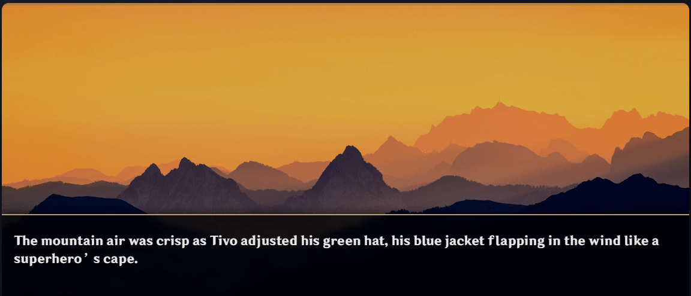

# Dynamic Narrative Engine

 

A robust self-contained application for creating dynamic long-form narratives using AI. This engine combines a multi-agent AI system powered by a persistent, dynamic world-state that ensures long-term continuity, coherence, and linear character development while offering a seamless creative cycle workflow.

This was created to get a deeper understanding of modern AI techniques and solve problems found on the most popular role playing systems.

*   **SillyTavern**: A fantastic tool with a lot of depth and capabilities, but it's also its weakness. It feels overwhelming and is too complex for the average user who just wants a plug & play experience.
*   **RisuAI**: Simple to use but lacks more advanced features.

However what I found on every RP (role-playing) system is that they all share the same limitations: They have very limited multi-character support, bad long context / memory management and require the user to do exhaustive "lore books". They strive to complete the user's narrative on mostly one LLM call. This is correct for the user experience to feel snappy and to save costs, but nowadays high end popular models have gotten very cheap, so it's now reasonable to have a multi-agent RP experience, where we give each LLM a specific task instead of relying on large monolithic API calls that result in subpar output due to LLM's instruction overflow and attention drift. Using a multi-agent setup ensures every part of the experience goes to it's fullest potential and the narrative retains supreme quality and consistency while giving life to multiple characters simultaneously.

## Core Vision

This project aims to address the fundamental limitations of other AI storytelling systems, including poor long-term memory, poor narrative consistency, and a non-linear creative workflow. Rather than a story being a single continuous sequence of text (chat), this engine models it like a simulated world. The user can easily engage in a brand new story, or base it on his favourite fiction and be able to experience and interact with a "What if?" sequel.
This engine features a ground-up architecture with the design goals to:

*   **Understand Context:** Distil a sophisticated layered memory system. It provides the AI with deep, nested, regressive context by filtering relevant context from the story's entire history.
*   **Consistent Ongoing Narrative:** Maintain a factual "world brain" which tracks characters, locations, relationships, and inventory, and prevent logical contradictions.
*   **Multi Character Support:** Supports multiple characters at once, they can enter and leave the scenes at will, appear on the screen simultaneously, interact and each have their own personalities, relationship tracking and goals.
*   **Allow Ongoing Character Development:** Characters must change, and so too must their relationships, dynamically over recent previous events as the narrative evolves.
*   **Empower the Creator:** All-in-one environment for world-building, writing, testing, and experiencing the final story.
*   **Drag & Drop Asset Management:** No manual definition of every visual asset. Simply drop "Forest.png", "Desert.png" to the project's background folder, "Serene.mp3", "Windy.mp3" to the music folder or "Tivo_happy.png", "Tivo_sad.png" for automatic asset usage.

## Key Features

*   **Hierarchical Long-Term Memory:** A unique Fulltext -> Summary -> Synopsis -> Arcs Hierarchy is used to model the limits of the AI context window. Further augmented with a "Slotted RAG" (Retrieval Augmented Generation) system to inject relevant memories back into their historic chronological position in the narrative timeline to provide the AI with important temporal context.

*   **The "Director" AI:** A 'Director' agent (Orchestrator) reviews the narrative events periodically. It offers high-level feedback and guidance to direct an overarching main 'Writer' AI to mitigate plot drift and maintain thematic representation longitudinally. Keeps an internal notebook in a self-feedback loop to keep track of the narrative's goals, keeping the writer reality anchored and naturally reminding it of key missing events.

*   **Dynamic World-State:** The engine parses narrative text logs after each turn of events to extract and track key narrative facts (e.g., `RELATIONSHIPCHANGE: Tivo, Player, +5`, `INVENTORYCHANGE: Player, Pickaxe +1`). The results create a persistent "world brain," extracting the final systems process as the 'ground truth' story-state. This includes **Programmatic World State Synthesis**, where the system queries the database for the latest facts (e.g., current location of all characters, total inventory) and programmatically synthesizes this data into a concise, natural-language paragraph for the Orchestrator AI.

*   **Advanced, State-Sensitive Character Relationships:** Managed by `relationship_manager.js`, character relationships are modeled using a multi-vector, asymmetrical system. Instead of a single score, relationships are tracked across five distinct vectors: **Friendship, Romance, Trust, Fear, and Respect**. The system understands that a character's feelings are not always reciprocated; Character A's trust in Character B can be different from Character B's trust in Character A. These relationship scores are established at the start of the story by an LLM call and are then updated incrementally each turn based on the narrative events, allowing for organic and dramatic character development. For efficiency, relationship summaries are generated programmatically from their stored scores.

*   **State-Sensitive Character Evolutions:** Character personality traits (quantified across 16 distinct traits by `personality_manager.js`) and numerical relationships track based on in-story events as structured data. This data is then distilled or synthesized back into natural language rules (e.g., `[Tivo is now more confident]`) and injected into the AI performance prompt for tracking over time.

*   **Frictionless Asset Pipeline:** Simple drag-and-drop functionality for character sprites, background images, and music. The system automatically generates its palette of possible character emotions by parsing sprite filenames (e.g., `Cid_Angry.png` adds "Angry"). It selects the best assets based on file names indicated by the narrative context—no need for developers to edit lengthy, complex configuration files. This works with an intelligent, "heat-based" sprite positioning system that replaces the "coldest" character on a full screen, further reducing manual configuration. Backgrounds and music are selected by a dedicated LLM call that is given deep temporal context, including the current scene text, a summary of the previous scene, a synopsis of the scene before that, and the previously chosen asset. For projects with large music libraries, the system first uses vector similarity search to prune the list of all songs down to the most thematically relevant candidates. Only this smaller, pre-filtered list is then presented to the LLM for final selection, improving efficiency and relevance.

*   **Integrated Creation Environment:** The application is a stand-alone project and file-folder package, a contained manager where creators can construct their world bible, edit character sheets, and write world lore in the same environment. It offers an integrated workflow from concept to execution. This is powered by a file persona system, where users can assign a "mode" (e.g., `summary`, `charsheet`, `full`) to each lore file, influencing how the prompt builder processes its content.

*   **Built-in Diagnostics & Performance Monitoring:** A real-time diagnostic interface provides creators with API request and responses, log keeping, a detailed description of each turn, including processing time and estimated token cost for each AI agent and process—enabling fine-tuning and optimization. The system employs a **Dual Log System**, generating a detailed `turn_[timestamp].json` for structured data and a `console_[timestamp].log` for verbose console output, providing a complete trace for debugging.

*   **High Modularity and Configuration:** The user can choose which modules are active, their LLM models, their third party accounts, debug level, etc.

*   **Dynamic Triage & Pacing:** Introduces `narrative_pacer.js` to act as a high-speed "Triage Director." It analyzes immediate context (user prompt, last turn, historical summaries, director's notes) using a fast LLM, classifying the upcoming turn's needs and assigning an operational mode (SIMPLE, COMPLEX, PLOT_CRITICAL) to both the Orchestrator and the Writer. This dynamically executes one of three pipelines, balancing quality and latency, and includes a failsafe to periodically force Orchestrator runs.

*   **Visual Novel (VN) Transformation:** Transforms generated story text into visual novel sequences, with status updates managed by a simplified popup GUI. It includes **LLM-Powered Dialogue Structuring** that uses a dedicated LLM call to parse raw narrative into a clean, structured format with `<meta_context>` and `<dialogue>` tags, making the system more resilient. It also features **TTS Narrator Activation**, allowing users to enable or disable TTS generation for narrative lines, providing an audible voice for descriptive text with gender-aware voice selection thanks to the **Automatic Gender Detection & Gender-Aware TTS** utility (`genderguesser.js`).

*   **Advanced Player Choice Generation:** Player choices are generated with nuance, triggered probabilistically to balance guided choices with free-form input. When triggered, an LLM generates choices based on different character archetypes (e.g., Brave vs. Cautious, Good vs. Evil) and can even include a risk/reward analysis for each option.

*   **Automated Test Flow (CLI Mode):** Provides an `npm run test-flow -- "<prompt>"` command to execute a full, unattended narrative generation sequence. This mode automatically uses the 'Test' project, creates a new temporary chat database, executes the flow with the provided prompt, and exits on completion or after a timeout, ideal for integration testing and verifying the end-to-end pipeline.

*   **Knowledge Graph Viewer:** From the Fact Viewer, the user can launch a pop-up window that renders the project's entire knowledge base as an interactive graph using `sigma.js`. This provides a clear, visual overview of all the subject-predicate-object triples that form the story's memory.

*   **Scene History Viewer:** Allows the user to view a history of past scenes and replay them in the visual novel viewer.

*   **Multi-Provider LLM Support:** The `modules/llm.js` module is built to handle interactions with multiple LLM providers via LangChain, with `settings.json` configuring which models/providers are used for different agents (e.g., Orchestrator, Pacer). This flexibility to switch between services like OpenRouter, Ollama, or others is a significant architectural feature.

*   **Dynamic Prompt Injection:** The user's prompt is reformulated as an "attempt" (e.g., `Player: Attempts to...`), giving the AI more agency to decide the success or failure of an action and how other characters react.

*   **Parallelized and Asynchronous Scene Processing:** To reduce user-perceived latency, the engine processes visual novel scene components in two stages:
    1.  **Parallel Blocking Tasks:** Core components needed to render the scene (asset selection, emotion classification, sprite arrangement, player choice generation) are executed simultaneously.
    2.  **Asynchronous Background Tasks:** Post-scene tasks not required for the immediate next turn's prompt (TTS generation, summary/synopsis generation, knowledge graph updates) are executed as "fire-and-forget" operations, completing in the background while the user views the current scene. The application UI provides notifications for these background tasks.

## Architectural Overview

The engine is a modular, event-driven architecture—designed for resiliency and extensibility. The backend processes are managed in Node.js and communicate with the Electron frontend via Socket.IO multi-webview.

*   **Core Application:** The UI is managed by an Electron shell. The main process is Node.js. All inter-process communications are handled as real-time events using Socket.IO.

*   **AI Agent System:** Multiple LLM agents with specialized functions work together:
    *   **Writer:** Generates the core narrative prose.
    *   **Director (Orchestrator):** Provides high-level creative direction.
    *   **Fact Extractor:** Parses text and generates structured world state data.
    *   **Synthesizer:** Converts structured data back into natural language to construct prompts.
    *   **Auxiliary Agents:** A set of smaller agents for functions like emotional classification, asset selection, or dialogue formatting.

*   **Dual-Memory System:** The engine maintains context using two separate but related memories:
    *   **Semantic Memory (ChromaDB):** A vector memory that stores text embeddings for "auto" lore files and the full history of chapter files. It answers, *"What parts of the story are relevant right now?"*
    *   **Factual Memory (SQLite):** A relational memory that stores structured world state data. It answers, *"What is verifiably true in the world right now?"*

*   **Knowledge Graph (Subject-Predicate-Object Triples):**  The system builds and maintains a dynamic Knowledge Graph from extracted facts, representing relationships as (Subject; Predicate; Object) triples (e.g., (Tivo; SON_OF; Sebastian), (Sword; LOCATED_IN; Cave)). This structured representation allows for robust querying and logical inference about the world state and character relationships.

## Technology Stack

| Category | Technologies |
| :--- | :--- |
| **Core Backend** | Node.js, Electron.js, Socket.IO |
| **Databases** | ChromaDB (Vector Store), SQLite (Fact Store) |
| **AI/LLM** | OpenRouter API, Ollama (Embeddings), LangChain.js |
| **Frontend** | HTML, CSS, JavaScript (Vanilla), Sigma.js (for Knowledge Graph visualization) |
| **Libraries** | Axios, Marked.js |
| **TTS (External)** | Spark-TTS or Alltalk TTS |
| **Diffusion (External)** | Webui1111 or ComfyUi |

## Cost & Latency

Using the right high-end models and providers results in up to 0.02$ per turn, which is on par with similar systems while delivering higher quality multi-agent functionality.
A turn can take more time to process than similar systems due to the number of LLM calls but still rounds about 1/4 processing/experience ratio. (e.g. 40s of processing for 2~3m of reading)

## Visual Showcase

| In-App Editor & File Management |
| :---: |
|  |

| Visual Story Player |
| :---: |
|  |

| Performance & Cost Dashboard |
| :---: |
|  |

---

## Example of a Full System Flow

To illustrate how all the components work together, here is a step-by-step walkthrough of a single turn, from user input to final output.

**1. Setup & Configuration (The Creator's Workflow)**
-   The user first selects their project. In the "Obsidian" view, they see their project's file structure.
-   Using the dropdown next to each file, they assign a "persona" or "mode" to their lore files. `my_characters.md` is set to `charsheet`, `world_history.md` is set to `summary`, and `important_rules.md` is set to `full`. This tells the engine how to process these files later.

**2. User Action (The Spark)**
-   In the Visual Novel viewer, the user is presented with a scene. They type their action, "I draw my sword and inspect the strange altar," and press "Go."

**3. Kickoff & Triage (The Backend Awakens)**
-   The `generate-vn-turn` event is sent to `main.js`. A new `TurnContext` object is created, which will act as a "capsule" carrying all data for this turn.
-   The **Narrative Pacer** (`narrative_pacer.js`) is the first AI agent to act. It analyzes the user's prompt and the last few turns, determines this is a standard action, and sets the turn's mode to `COMPLEX` inside the `TurnContext`.

**4. The Director's Review (Orchestration)**
-   As a direct result of the `COMPLEX` decision from the Triage step, the **Orchestrator** (`orchestrator.js`) is now executed.
-   It analyzes the story's history, character arcs, and the current world state to ensure long-term coherence.
-   It generates a "Writer's Brief"—a set of high-level instructions and suggestions—and places it into the `TurnContext` for the next agent to use.

**5. Prompt Assembly (The Great Gathering - *Now Highly Parallel*)**
-   The **Prompt Builder** (`prompt_builder.js`) immediately calls the **Query Generator** utility, which makes a single LLM call to create 5-10 variations of the user's prompt ("I inspect the altar," "What is on the altar?", "A close look at the strange altar," etc.).
-   With this array of queries, it launches a `Promise.all` to fetch all context **simultaneously**:
    - It searches the static lore database for information related to "altars" or "rituals."
    - It searches the history of past chapters for any previous encounters with similar altars.
    - It generates KG insights about entities related to the last turn.
    - It synthesizes a personality snapshot for any new characters who just entered the scene.
-   Once all these parallel tasks complete, the Prompt Builder rapidly assembles the fetched data, the Director's brief, and the static files into the final, context-rich prompt.

**6. Narrative Generation (The Creative Act)**
-   The **Writer AI** (`narrativeengine.js`) receives the prompt and generates the story for the current turn, describing the character drawing their sword and what they see at the altar.

**7. Parallel and Asynchronous Processing (The Transformation)**
-   The moment the raw text is generated, the **VN Manager** (`vnmanager.js`) begins its work, splitting tasks to minimize latency:
    -   **Blocking Parallel Tasks:** It simultaneously runs all processes required to immediately display the scene to the user. This includes structuring dialogue, selecting assets (backgrounds, OST), classifying emotions, generating player choices, and extracting facts critical for the world state. The system waits for all these to complete.
    -   **Asynchronous Background Tasks:** As soon as the blocking tasks finish and the scene is sent to the user, the system triggers "fire-and-forget" background tasks. These now include requesting **Text-to-Speech (TTS) generation**—with a payload enriched by the character's guessed gender for accurate voice selection—alongside generating the turn's **summary** and **synopsis** and updating the story's **knowledge graph**. The UI notifies the user that these tasks are running and when they complete.

**8. Final Assembly & Display (The Showtime)**
-   Once the parallel tasks are complete, the `vnmanager` assembles the final scene:
    -   It finds the correct sprite (`player_curious.png`).
    -   The `sprite_positioner` arranges it on the screen using the "heat" system.
    -   The final sequence of dialogue, sprites, background, music, and player choices is finalized.
-   This final sequence is sent to the **VN Viewer** UI, and the user sees the scene they created, complete with visuals, music, and new choices.

**9. Committing to Memory**
-   The entire, fully-populated `TurnContext` object—containing the user's input, all the intermediate data from every agent, and the final VN sequence—is saved as a single, atomic record into the project's SQLite database. The turn is now a permanent part of the story's history.

## Implementation Ideas & Optimizations
*   GUI to be able to smoothly see the world state and relationship status of the current scene. (Partially addressed by the Knowledge Graph Viewer and Fact Viewer, but a dedicated "live" view is still a great idea).
*   Ambient animations such as light rays, snow, wind or rain.
*   Sprite animations or even live2d integration.
*   Allow exporting the story into a standalone visual novel player. If the user has concluded his story and wishes to export it for future replayability or to share with someone else.
*   More ambitious: Create a living world that happens beyond the screen. Placing the user on a concrete position within a world map and having events and characters interacting in the background shaping the entire adventure indirectly.
*   **Chat History RAG Processing Optimization:** Refactor the Chat History RAG system to only process each synopsis once when it first becomes "old," rather than re-validating it on every subsequent turn, to reduce unnecessary overhead as the story's history grows.

---

## Regarding Source Code

This is an ambitious, ongoing hobby project, hence the source code is not available right now. This repository serves as a detailed architectural showcase of the design and potential. I plan to release the source code publicly once it's feature complete in the near future. However I have included a code_reference that superficially goes through my entire codebase.
